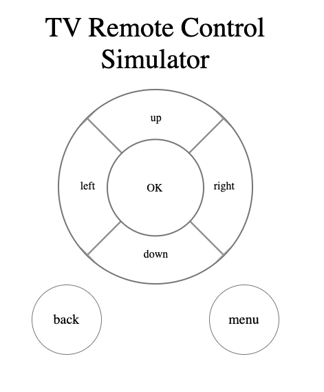

## 使用其他语言阅读： 简体中文 | [English](./README.md)

## 快速上手

### 简介

`tv-remote-control` 是一个提供给开发者在电脑上实现电视遥控的模拟器，通过它，你可以非常简单地操控连接到电脑上的安卓电视（或其他安卓设备），不再需要输入繁琐的adb指令啦！

### 全局安装插件

### 全局安装插件

首先, 你需要全局安装 `tv-remote-control` 插件。

```sh
npm install tv-remote-control -g
```

### 设备连接

确保设备（Android 系统）的USB调试权限已经打开，并且已经成功连接到电脑。你可以使用以下命令检查设备是否成功连接：

```sh
adb devices 
```

PS：你需要确保电脑已经正确安装了`adb（Android 调试桥）`。

如果你是macOS用户，你可以通过[homebrew](https://brew.sh/)进行安装，具体步骤可参考[这篇文档](https://www.jianshu.com/p/1b3fb1f27b67)。

如果你是Windows用户，你可以进入[官网](https://developer.android.google.cn/studio/command-line/adb)下载安装`adb`相关资源，正确配置环境变量后即可在命令行使用`adb`指令，具体步骤可参考[这篇文档](https://blog.csdn.net/qq_43506952/article/details/88395194)。

### 启动服务

执行以下指令，启动电视遥控服务。

```sh
trc start
```

可选参数：

| 属性    | 类型   | 说明                                                                                |
| ------- | ------ | ----------------------------------------------------------------------------------- |
| --port, -p | number | 指定遥控模拟器页面的端口 <br/> 示例代码：使用`trc start -p 3002`或`trc start --port 3002`指定端口|

运行上述命令之后，`tv-remote-control` 会自动调用默认浏览器，并打开页面`http://127.0.0.1:<port>/index.html`。

你可以在此页面上点击按键或操作键盘，模拟遥控交互，操作连接在电脑上的电视或其他设备。

PS：您也可以手动复制上述网址，粘贴至浏览器打开。

### 指令说明

你可以通过单击网页上的按钮或操作键盘来控制电视，下表是指令的具体说明：

| 按钮     | 键盘键位           | 电视遥控指令 |
| ------- | -------------- | --------- |
| up      | 上             | 上       |
| left    | 左           | 左       |
| right   | 右          | 右       |
| down    | 下           | 下       |
| ok      | enter          | 确认       |
| menu    | shift          | 菜单       |
| back    | B              | 返回       |

你也可以通过访问 `http://127.0.0.1:<port>/[up]|[left]|[right]|[down]|[ok]|[menu]|[back]` 来直接执行对应的键位指令.
